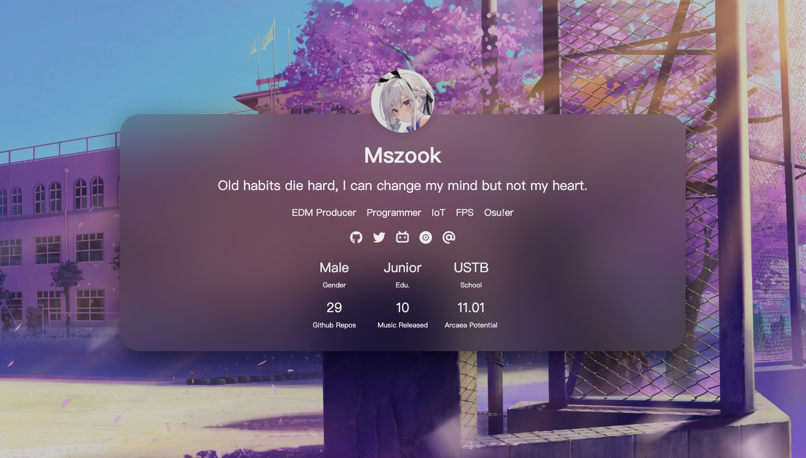

# Flush

毛玻璃卡片风格个人简介主页。

- 高斯模糊卡片设计
- 支持跟随系统的暗色模式
- 非线性动画效果
- 响应式设计

Demo: https://flush.mszook.art/

<details>
    <summary>预览</summary>
    <div style="align-content: center;">
        
    </div>
</details>


## 部署

安装nodejs

克隆仓库到本地并安装依赖

```
git clone https://github.com/WitchElaina/Flush
cd Flush
npm i
```

## 配置

复制配置模板

```
cp ./ext/config_template.yml ./config.yml
```

配置遵循yml语法，如遇问题可以参考配置案例`/ext/config_example.yml`

## 运行

```
node ./server.js
```

## TODO

- [ ] 动态获取数据
- [ ] 生成静态页面
- [ ] 手动切换暗色模式 
- [ ] 适配其他SVG图标
- [ ] 优化mobileUI
